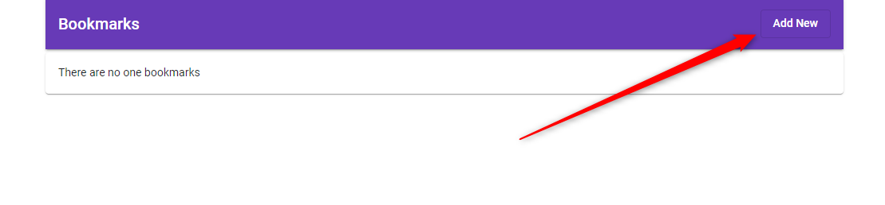
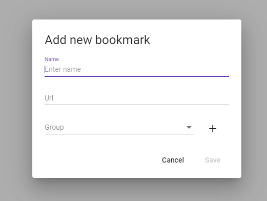
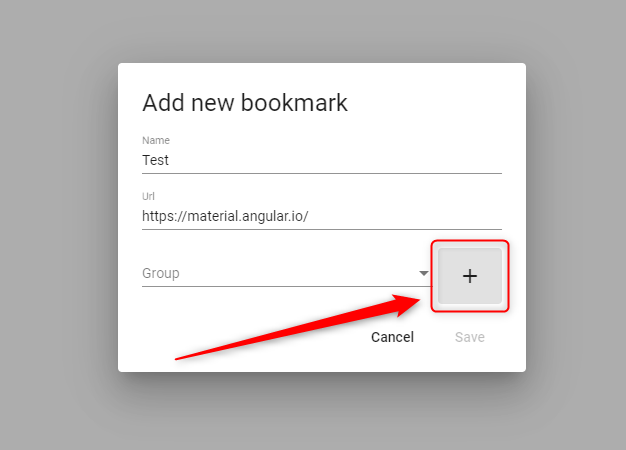
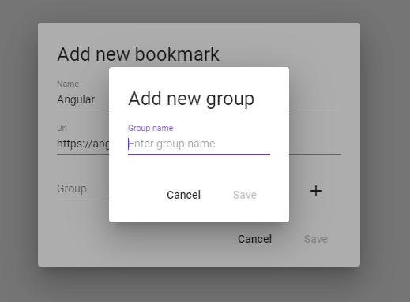
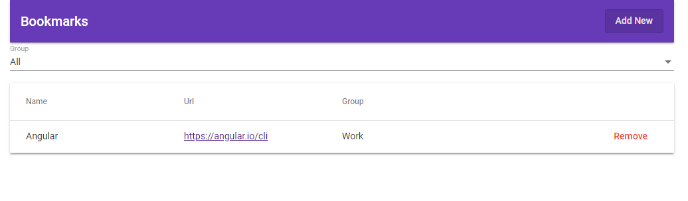
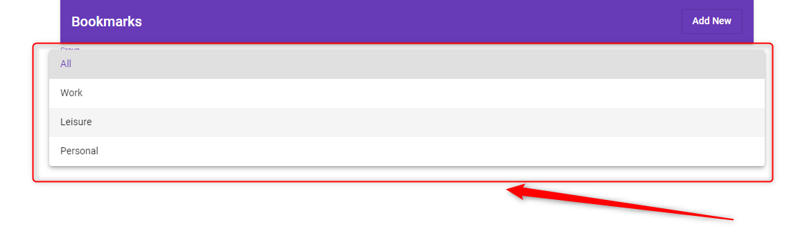
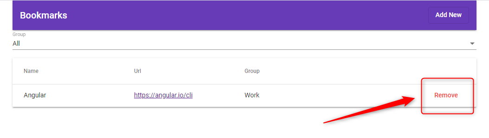
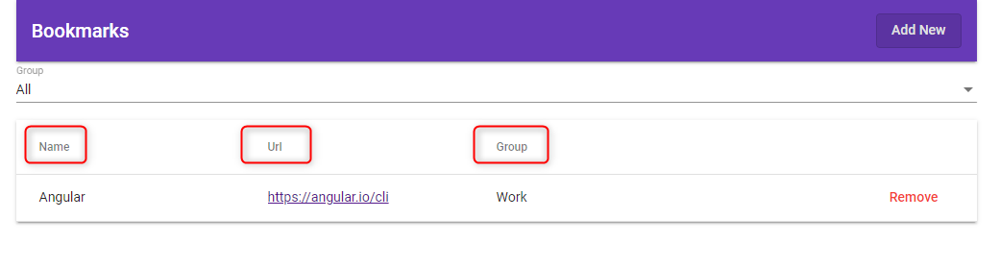

## Application

The main idea of application is to realize user interface to add bookmarks, filter, group and remove unnecessary bookmarks.

You can add bookmark by click button 'Add New' placed in the top corner of page.

In popup you should fill all fields (name, url, group).

You have possibility to add a new group by click button '+'.

In new popup you should provide new group name.

When all necessary information is provided and button 'Save' is pressed, bookmark will be stored

You have possibility to filter your bookmarks by group.

Unnecessary bookmarks could be removed by click button 'Remove'.

Bookmarks can be sorted by click on header in the table.

## Start Application

1. Run `npm i` to install all necessary dependencies;

2. Run `ng serve` for a dev server. Navigate to `http://localhost:4200/`.
